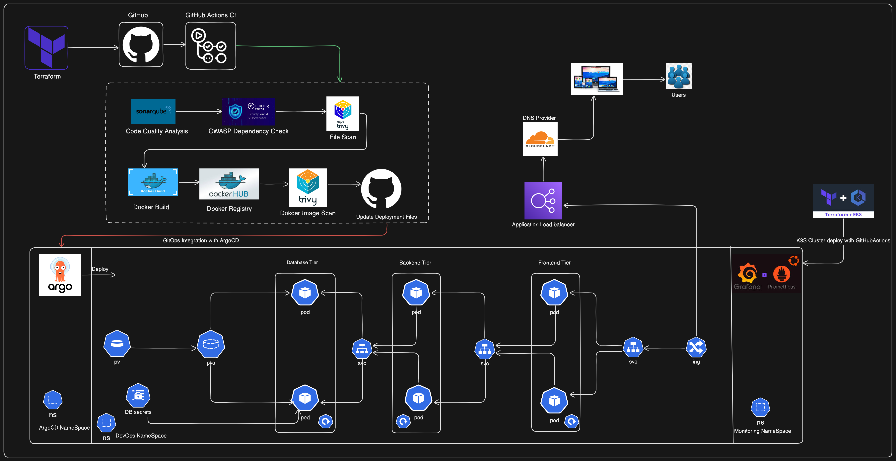

# 🚀 Welcome to the End-to-End-DevSecOps-Kubernetes-ThreeTier Pipeline Project! 🚀
[](https://www.linkedin.com/in/venkateswarareddy-sanikommu-01278a77/)
[](https://github.com/venky1912)
[](https://www.serverless.com)
[](https://aws.amazon.com)
[](https://www.terraform.io)




# **As well as EKS cluster**
# 🚀 Configuring Production-Ready EKS Clusters with Terraform and GitHub Actions 🚀


This repository hosts the complete setup for an advanced DevSecOps pipeline. The project integrates a wide range of tools and practices for a secure, automated, and scalable deployment process on AWS EKS.

### Step 1: Install Terraform & AWS CLI
Install & Configure Terraform and AWS CLI on your local machine 

#### Terraform Installation Script for WSL
```sh
wget -O- https://apt.releases.hashicorp.com/gpg | sudo gpg - dearmor -o /usr/share/keyrings/hashicorp-archive-keyring.gpg
echo "deb [signed-by=/usr/share/keyrings/hashicorp-archive-keyring.gpg] https://apt.releases.hashicorp.com $(lsb_release -cs) main" | sudo tee /etc/apt/sources.list.d/hashicorp.list
sudo apt update
sudo apt install terraform -y
```

#### AWSCLI Installation Script
```sh
curl "https://awscli.amazonaws.com/awscli-exe-linux-x86_64.zip" -o "awscliv2.zip"
sudo apt install unzip -y
unzip awscliv2.zip
sudo ./aws/install
```
Now, Configure both the tools

#### Terraform and AWSCLI Installation on MacOS
```sh
brew install terraform
brew install awscli
```

#### Configure AWS CLI

Run the below command, and add your keys from Step 2

```sh
aws configure
```

Review **.github/workflows/terraform.yml**

```sh
git add .
git commit -am "updated eks-terraform.yml and eks prod.tfvars files"
git push
```

With the couple of changes made in the eks/ folder. 
Github Actions workflow will be trigger. 
Go to the repo on Github abd click on the Actions button to the see the Github Action workflow running.

Go to the EC2 and EKS on AWS Console


Run the command below to connect to the EKS cluster created  allowing Kubernetes operations on that cluster.
```sh
aws eks update-kubeconfig --region <your-region> --name <your-cluster-name>
```

Once the cluster is created, you can validate whether your nodes are ready or not by the below command

```sh
kubectl get nodes
```

#### Configure Load Balancer on the EKS
Configure the Load Balancer on our EKS because our application will have an nginx ingress controller.
Download the policy for the LoadBalancer prerequisite.
```sh
cd ingress-controller
Run the Commands
```

###  Configure ArgoCD
Create the namespace for the EKS Cluster. In your jumphost server terminal
```sh
kubectl get ns
```

Now, we will install argoCD.
To do that, create a separate namespace for it and apply the argocd configuration for installation.

## Install Argo CD using manifests

```bash
kubectl create namespace argocd
kubectl apply -n argocd -f https://raw.githubusercontent.com/argoproj/argo-cd/stable/manifests/install.yaml
```

## Access the Argo CD UI (Loadbalancer service) 

```bash
kubectl patch svc argocd-server -n argocd -p '{"spec": {"type": "LoadBalancer"}}'
```

## Get the Loadbalancer service IP

```bash
kubectl get svc argocd-server -n argocd
```

**Login to ArgoCD**
    - The default username is `admin`.
    - Retrieve the password using:
      ```sh
      kubectl -n argocd get secret argocd-initial-admin-secret -o jsonpath="{.data.password}" | base64 --decode; echo
      ```

# Install Grafana using Helm

## Add helm repo

`helm repo add grafana https://grafana.github.io/helm-charts`

## Update helm repo

`helm repo update`

## Install helm 

`helm install grafana grafana/grafana`

## Expose Grafana Service

`kubectl expose service grafana — type=NodePort — target-port=3000 — name=grafana-ext`


# Install Peometheus using Helm

## Add helm repo

`helm repo add prometheus-community https://prometheus-community.github.io/helm-charts`

## Update helm repo

`helm repo update`

## Install helm 

`helm install prometheus prometheus-community/prometheus`

## Expose Prometheus Service

This is required to access prometheus-server using your browser.

`kubectl expose service prometheus-server --type=NodePort --target-port=9090 --name=prometheus-server-ext`

## Table of Contents
- [CI/CD Pipeline Overview](#ci-cd-pipeline-overview)
- [GitHub Actions Workflow](#Github-Actions-Yaml-Files)
- [Infrastructure as Code (IaC)](#infrastructure-as-code-iac)
- [Continuous Integration](#continuous-integration)
- [Continuous Delivery](#continuous-delivery)
- [Monitoring and Alerts](#monitoring-and-alerts)
- [DNS and Load Balancing](#dns-and-load-balancing)
- [Getting Started](#getting-started)
- [Project Details](#project-details)

## CI/CD Pipeline Overview
This section provides a high-level overview of the CI/CD pipeline used in this project.

### 🌐 **Infrastructure as Code (IaC)**
   - **Tool:** Terraform
   - **Process:** Terraform provisions the required AWS resources, including an EKS cluster.
   - **Outcome:** Automated infrastructure deployment with GitHub Actions, ensuring consistency and repeatability.

## **Infrastructure as Code (IaC):Terraform**
```bash
   https://github.com/venky1912/End-to-End-DevSecOps-Kubernetes-ThreeTier-Project/.github/workflows/eks-terraform.yml
```


### 🛠️ **Continuous Integration**
   - **Tool:** GitHub Actions CI
   - **Code Quality:** SonarQube checks code quality.
   - **Security:** OWASP Dependency Check scans for vulnerable dependencies.
   - **Containerization:** Docker builds the application images.
   - **Security Scans:** Trivy scans Docker images for vulnerabilities.

## **Application workflow Yaml Files** 
```bash
https://github.com/venky1912/End-to-End-DevSecOps-Kubernetes-ThreeTier-Project/.github/workflows/backed-application.yml

https://github.com/venky1912/End-to-End-DevSecOps-Kubernetes-ThreeTier-Project/.github/workflows/frontend-application.yml
```

### 🚀 **Continuous Delivery**
   - **Tool:** ArgoCD
   - **Process:** ArgoCD automates the deployment of applications to the EKS cluster based on the configurations stored in GitHub.
   - **Outcome:** Ensures continuous delivery and deployment in a secure and scalable manner.

### 📊 **Monitoring and Alerts**
   - **Tools:** Grafana and Prometheus
   - **Process:** Deployed within the Kubernetes cluster to monitor system health and performance.
   - **Outcome:** Real-time visibility into system operations with alerts for any anomalies.

### 🌍 **DNS and Load Balancing**
   - **Tool:** Cloudflare
   - **Process:** Cloudflare manages DNS, directing traffic through an Application Load Balancer to the appropriate Kubernetes service.
   - **Outcome:** Ensures high availability and reliability of the application with efficient traffic management.

## Infrastructure as Code (IaC)
The `IaC` directory contains the Terraform scripts required to provision the infrastructure on AWS, including EKS clusters, security groups, and IAM roles.

## Continuous Integration
The `CI` directory houses the GitHub Actions workflows. These workflows automate the code quality checks, security scans, and Docker image builds to ensure the integrity of the codebase before deployment.

## Continuous Delivery
The `CD` directory includes ArgoCD configurations. ArgoCD is used to manage and deploy applications in a GitOps fashion, ensuring that the desired state of the Kubernetes clusters matches the configurations stored in Git.

## Monitoring and Alerts
The `Monitoring` directory contains Helm charts and configurations for deploying Grafana and Prometheus. These tools provide comprehensive monitoring and alerting capabilities for the deployed applications and infrastructure.

## DNS and Load Balancing
In the `DNS-LB` directory, you'll find configurations for setting up Cloudflare as the DNS provider and configuring the Application Load Balancer to manage traffic to your Kubernetes services.

## Project Details

🛠️ **Tools Explored:**
- **Terraform** for IaC on AWS
- **GitHub Actions** for CI workflows
- **SonarQube** and **Trivy** for code quality and security
- **OWASP** for Dependency security Check
- **ArgoCD** for continuous deployment on Kubernetes
- **Grafana** and **Prometheus** for monitoring
- **Cloudflare** for DNS and Load Balancing

🚢 **High-Level Overview:**
- Terraform provisions infrastructure on AWS.
- GitHub Actions CI automates code checks and Docker builds.
- ArgoCD ensures continuous deployment on EKS.
- Grafana and Prometheus monitor system health.
- Cloudflare manages DNS and traffic routing.

## Getting Started
To get started with this project, follow these steps:

1. **Clone the Repository:**
   ```sh
   git clone https://github.com/venky1912/End-to-End-DevSecOps-Kubernetes-ThreeTier-Project
   ```

2. **Provision Infrastructure:**
   - Navigate to the Terraform EKS directory then amend the changes according your requirement in `prod.tfvars` and run:
     ```sh
     terraform init
     terraform plan
     terraform apply
     ```

3. **Set up GitHub Actions:**
   - Configure repository secrets for AWS, Docker Hub, SonarQube and other integrations.

4. **Deploy Applications:**
   - ArgoCD will automatically deploy the application based on the Git configurations.

5. **Monitor Applications:**
   - Access Grafana to view real-time metrics and system health.

📈 **The journey covers everything from setting up tools to deploying a secure and scalable application pipeline.**

### License
This project is licensed under the [Apache License](LICENSE) - see the LICENSE file for details.

### Conclusion: 
In this comprehensive DevSecOps Kubernetes project, we successfully:

- Established IAM user and Terraform for AWS setup.
- Deployed Infrastructure on AWS using Github Actions and Terraform and, configured tools.
- Set up an EKS cluster, and configured a Load Balancer.
- Implemented all Security features with DecSecOps tools.
- Implemented monitoring with Helm, Prometheus, and Grafana.
- Installed and configured ArgoCD for GitOps practices.
- Created Github Action pipelines for CI/CD, deploying a three-tier architecture application.
- Ensured data persistence with persistent volumes and claims.

Stay connected on LinkedIn: LinkedIn Profile
Stay up-to-date with GitHub: GitHub Profile
Feel free to reach out to me, if you have any other queries.
Happy to Connect
